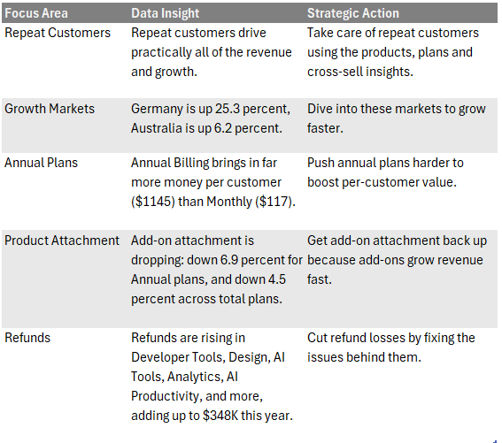
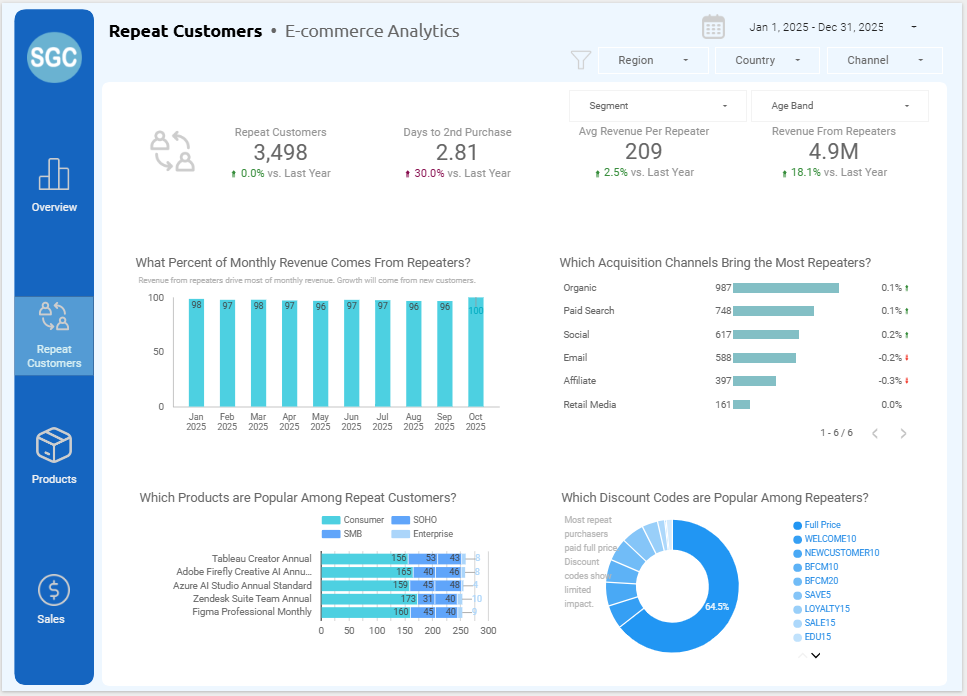
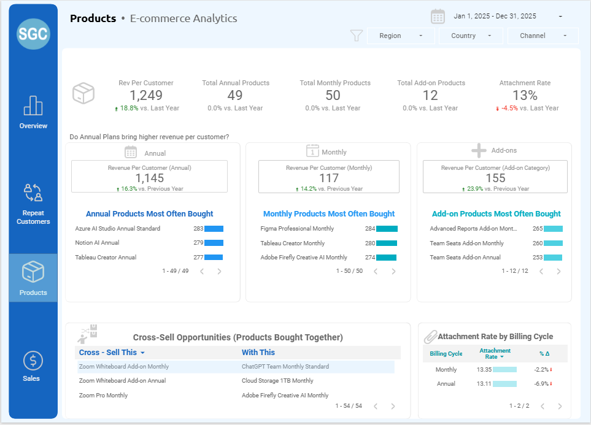
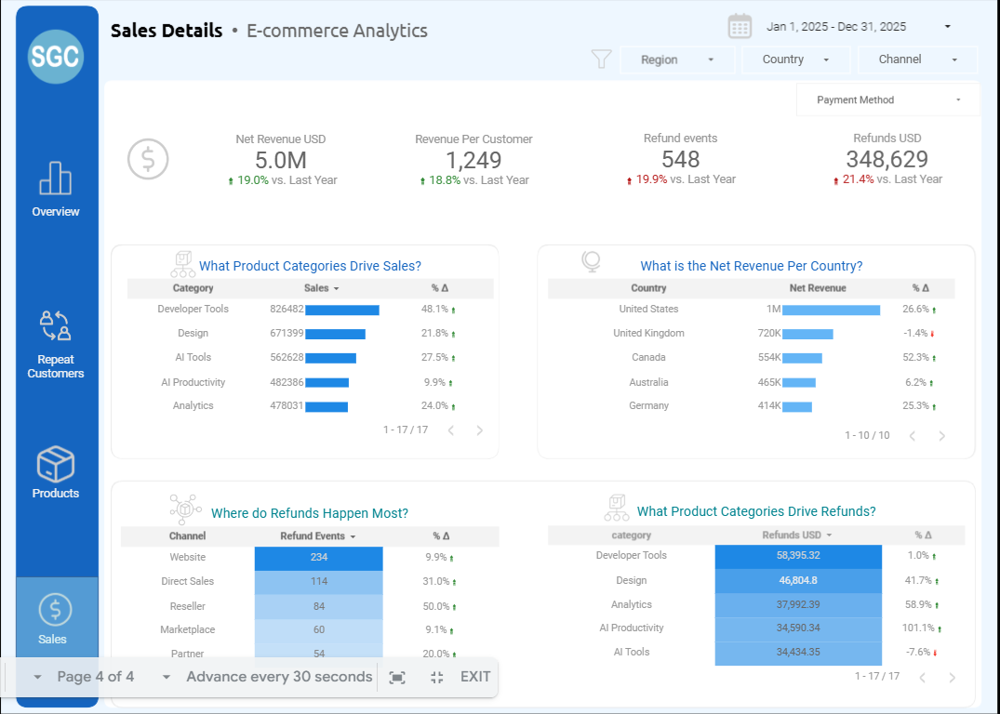

# Ecommerce Sales and Customer Analytics with Supabase, Google Sheets and Looker Studio
## Tools: Supabase (Postgres SQL), Google Sheets, Google Looker Studio  
[Click Here for the Dataset](https://datadna.onyxdata.co.uk/challenges/november-2025-datadna-ecommerce-analytics-challenge/)

# Overview  
The analysis shows that revenue growth is being driven almost entirely by repeat customers, with strong momentum in key markets like Germany and Australia. Annual plans deliver far higher value per customer, but attachment rates for add‑ons are slipping and refund losses are rising in several product categories. My pre-work ensured a unified revenue definition and standardized customer and product data, so that the dashboard can use a single source of truth. The dashboard itself consolidates the insights in four blocks: Overview, Repeat Customers, Products and Sales, to reveal repeat customers worth protecting, fast‑growing regions worth investigating for new revenues, improving plan mix, restoring add‑on performance, and explore root causes of refunds.

# Key Insights
- 

- [Dashboards Section](#dashboards)


# Technical Foundation 
- Revenue integrity was established by isolating non‑refunded invoices as the only source of confirmed revenue.  
- All dates were standardized to month‑start to ensure consistent time‑series aggregation.  
- Window functions were used to identify repeat customers and compute wait_days.  
- A unified semantic layer was created by joining cleaned event, customer, and product views.  
- This layer feeds the Looker Studio dashboard, which is organized into Overview, Repeat Customers, Products, and Sales Details.

# Strategic Actions  
- Strengthen retention programs targeting early repeat behavior.  
- Expand annual plan offerings and optimize conversion flows.  
- Investigate high‑refund product lines and address root causes.  
- Rebuild attachment rate through targeted cross‑sell and bundling.  
- Evaluate acquisition channels for quality rather than volume.  
- Explore growth markets where repeat behavior is strongest.

---
# Appendix: Technical Discussion  
## 0. Pre-Work: Cleaning data in SQL
As with every project, I needed to see if there were duplicates, if there were blanks, and if there were strange fonts. I did these from the raw stage tables (bronze) to the views (silver).

## Phase 1: Solving Key SQL Problems
A. Data Integrity: Defining Real Revenue
- A common complaint is that dashboards do not contain correct information. My first investigation showed that not all Orders proceed to Invoices, and most Invoices do not even pass through Orders stage. I needed to have the single source of truth (SSOT) for the correct final revenue.

```
| category            | cnt   |
| ------------------- | ----- |
| orders_not_proceed  | 33482 |
| invoices_not_orders | 14280 |
| orders_proceed      | 119   | 
```
- This means taking out the Orders and the Refunds, which if included, will reveal inaccurate Sales figures. I created a SQL field in the events_raw table called final_net_revenue_usd, where only invoice data are pulled if they are not refunded.
  
```
-- SQL pulls in only invoices 
--  Removes anything that is not confirmed revenue
ALTER TABLE events_raw
ADD COLUMN final_net_revenue_usd float;

UPDATE events_raw
SET final_net_revenue_usd =
    CASE 
        WHEN event_type = 'invoice' AND is_refunded = FALSE 
        THEN net_revenue_usd
        ELSE 0
    END; 
 ```


B. Data Integrity: Cleaning Up Time Series
- To make sure the monthly charts were accurate, I standardised each date to the first day of its month.
- Note that further downstream this will be used for the monthly revenue.
```
-- SQL year_month column
-- Adding a column and populating it with the first day of the month 
-- Using DATE_TRUNC to enable accurate time-series trending

ALTER TABLE events_raw
ADD COLUMN year_month date;

UPDATE events_raw
SET year_month = DATE_TRUNC('month', event_date)::date;      
```


C. Metric Creation: Spotting Repeat Customers
- To track loyalty, I needed to know exactly who was buying more than once. 
- I then calculated the wait_days, the time from first purchase to second purchase.
- Here, I used window functions to flag repeat customers.

```
-- Add the last_invoice_date, next_invoice_date
-- and days_since_last_invoice, days_to_next_invoice

CREATE OR REPLACE VIEW events_final AS
SELECT
    e.*,  
    
    -- Days since last invoice (NULL if none yet)
    (e.event_date -
     MAX(
        CASE WHEN e.event_type = 'invoice' AND e.is_refunded = FALSE
             THEN e.event_date END
     ) OVER (
        PARTITION BY e.customer_id
        ORDER BY e.event_date
        ROWS BETWEEN UNBOUNDED PRECEDING AND CURRENT ROW
     )) AS days_since_last_invoice,

    -- more transformations here
```
- I defined a repeater as someone who had a second purchase.
- For each customer, I also included wait_days, the time from first purchase to second purchase (only).
- Here, I used ROW_NUMBER() + OVER() to flag repeat customers.

```
-- SQL Action: Marking repeat customers
-- Joining the days_since_last_invoice from previous silver events_final_new view to customers_raw
-- Using Window Functions to identify customer's purchase order

CREATE OR REPLACE VIEW customers_final AS
WITH second_purchases AS (
  SELECT
    customer_id,
    event_date AS second_purchase_date,
    days_since_last_invoice AS wait_days,
    ROW_NUMBER() OVER (
      PARTITION BY customer_id
      ORDER BY event_date ASC
    ) AS rownum
  FROM events_final_new
  WHERE event_type = 'invoice'
)
SELECT
  c.*,
  sp.second_purchase_date,  
  sp.wait_days,
  CASE 
    WHEN sp.rownum = 2 THEN TRUE
    ELSE FALSE
  END AS is_repeater,
  DATE_TRUNC('month', signup_date::date)::date as signup_year_month
FROM customers_raw c
LEFT JOIN second_purchases sp
  ON c.customer_id = sp.customer_id
 AND sp.rownum = 2;  
```

D. Performance: Building The Final View as SSOT
- I combined all clean data views for each of the initial tables into one simple View (gold layer) for the dashboard.

```
-- SQL Action: Creating the final semantic layer
CREATE OR REPLACE VIEW combined AS
SELECT
  -- event-level (bring all columns from events_final_new)
  efn.*,

  -- customer-level columns (aliased to avoid collisions)
  c.customer_id            AS customer_id_c,
  -- all other fields
  -- plus new fields defined in views:
  c.wait_days,
  c.is_repeater,
  c.signup_year_month,

  -- product-level columns (aliased to avoid collisions)
  p.product_id             AS product_id_p,
  p.product_name,
  -- plus all other fields
FROM events_final_new efn
LEFT JOIN customers_final c
  ON efn.customer_id = c.customer_id
LEFT JOIN products_final p
  ON efn.product_id = p.product_id;    
```

E. Preliminary Exploration of Monthly Revenue
- Now with the gold layer, I was able to check the monthly revenue. 
- The SQL figures showed that these have levelled off at around 500K per month.
```
-- Monthly revenue

SELECT 
DATE_TRUNC('month', event_date)::date as year_month,
SUM(final_net_revenue_usd) as revenues_monthly
FROM events_final_new
GROUP BY DATE_TRUNC('month', event_date)::date 
ORDER BY DATE_TRUNC('month', event_date)::date
;
/**
| year_month | revenues_monthly |
| ---------- | ---------------- |
| 2024-04-01 | 121910.57        |
| 2024-05-01 | 506388.55        |
| 2024-06-01 | 497415.93        |
| 2024-07-01 | 515789.25        |
| 2024-08-01 | 514981.49        |
| 2024-09-01 | 485344.2         |
| 2024-10-01 | 497218.31        |
| 2024-11-01 | 539982.86        |
| 2024-12-01 | 510467.54        |
| 2025-01-01 | 503820.91        |
| 2025-02-01 | 435042.44        |
| 2025-03-01 | 551035.06        |
| 2025-04-01 | 536679.05        |
| 2025-05-01 | 491885.35        |
| 2025-06-01 | 557434.55        |
| 2025-07-01 | 535488.2         |
| 2025-08-01 | 504317.43        |
| 2025-09-01 | 496518.91        |
| 2025-10-01 | 373970.69        |
**/      

```
I proceeded to do a lot more preliminary analysis using Postgres SQL in Supabase. 
- [SQL scripts used in Supabase for set-up](sql/supabase_scripts_setup.sql)
- [SQL scripts used in Supabase for preliminary analysis ](sql/supabase_scripts_analysis.sql) 
- [Back to top](#summary)
## Phase 2: The Strategic Insights From the Looker Studio Dashboard
- After combining the Views into a gold layer, I exported the csv from Supabase and imported it into Google Sheets. So, I was able to proceed with the Looker Studio visualizations.
- I organized them into four pages: Overview, Repeat Customers, Products and Sales Details.
  ### Dashboards
- 
- 
- 
- 
[Back to top - Technical Foundation](#technical-foundation)

- Here is a recap of the key Data Insights and the Strategic Actions.

- 

## Recap
- I confirmed that Total revenue is up, driven by repeat customers.
- Monthly revenue is levelling off though.
- To grow further, the business needs to ensure that repeat customers do not churn.
- Future growth will come from stronger annual plan sales, diving into growth markets, maximizing acquisition channels, regaining attachment rate and fixing the rising refund problem.

